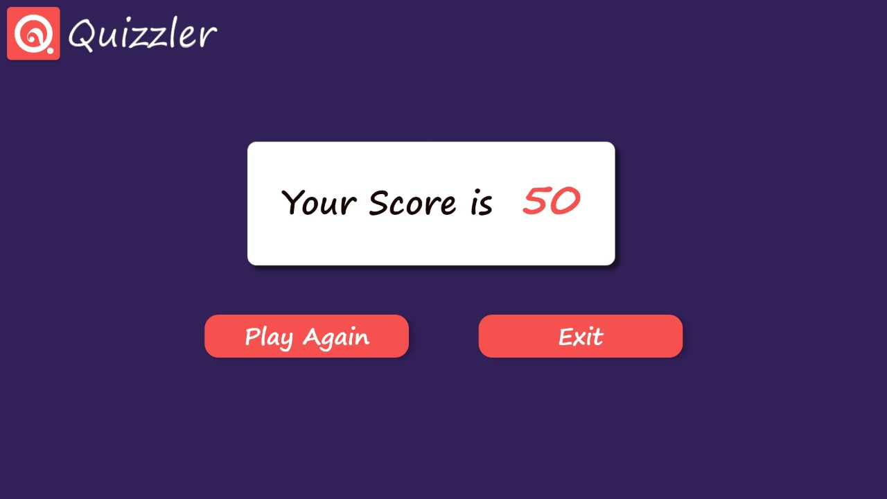

# <a href="https://ahmedhalbas.github.io/QuizzlerWebsite/Login-page/login.html" target="blank">Quizzler  Website :interrobang:</a>
Quizzler runs in your web browser, Quizzler is designed from the ground up to be the easiest quiz night you'll ever run.

## Page.1 

## Features : 
1. Login form with all validation forms  will be handled with (regular expressions )
2. Highest score list keeping track of user scores collected in each category (will be handled with persistence cookies )
 3. On login, the user will be directed to __page 2__

## Page.2 

## Features : 
1. User can choose the questions category before starting the game. 
2. Based on the user-selected category question will be loaded from the local JSON file will be handled using (ajax)
3. The page will have some animation using jquery UI library 
4. Based on user click on a specific category will be automatically directed to a __page 3__

## Page.3 

## Features : 
1. Questions will appear one after another on the same page after the user clicks on the answer.
2. Right and Wrong signs will be animated appears bases increment based on user answer to make the user keep track of his answers 
3. Questions updates on the page will be animated (shaking if wrong then disappear and the next question appears if right different animation effect will be applied).
4. After the last question submission user will be directed to __page 4__.

## Page.4 

## Features : 
1. The results page will present the user’s score after each quiz. 
2. User will have two option one to back to the home page (page 1).
3. The other option to back to the category list to choose a category (page2) and play again.

## Common Features
 1. Whenever the user clicks on the logo image within any page he/she will be directed to (page 1)
2. If the user clicked on the logo image while the quiz is running in (page 3) his/her score will not be counted for this quiz.
